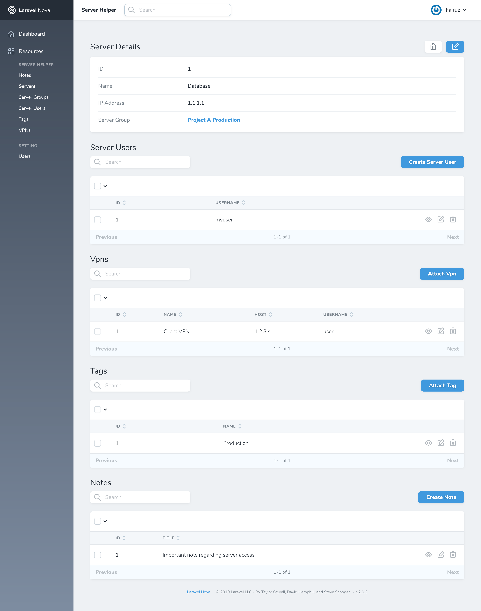
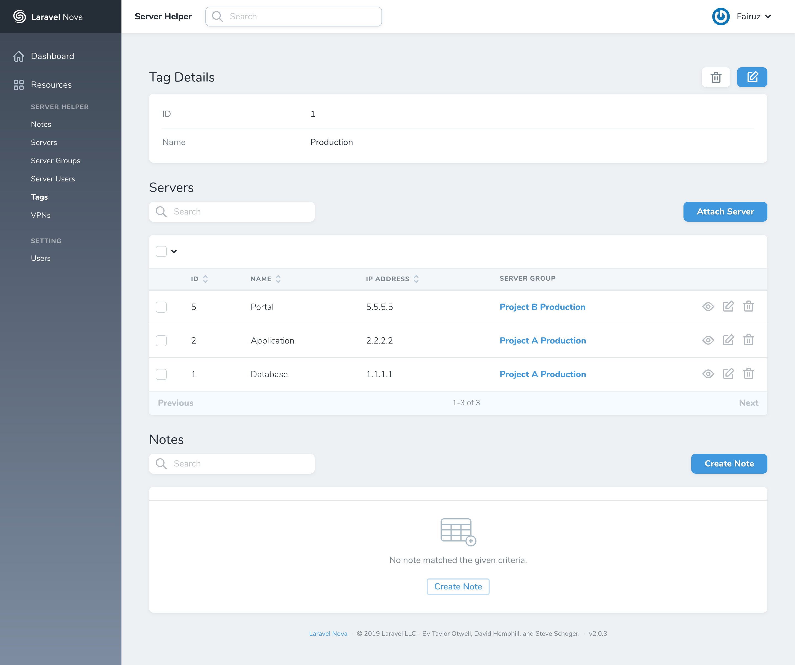
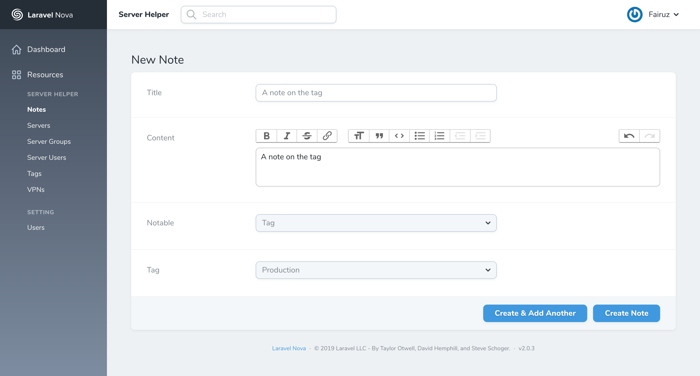
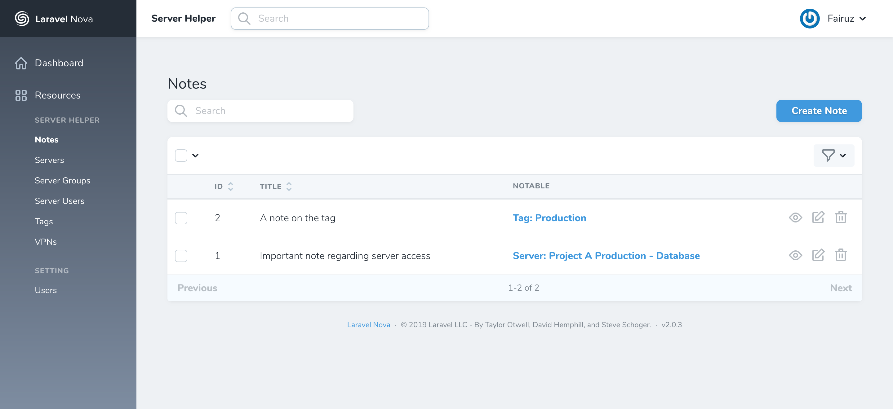

# nova-server-helper
A simple system to keep track server information developed using Laravel Nova.

## Installation

Clone this repository and put nova folder at the root of the project.

Setup your Laravel as per usual.

## Usage

Use `fairuz.ismail@nazrol.tech / admin123` to login.

## Screenshots

